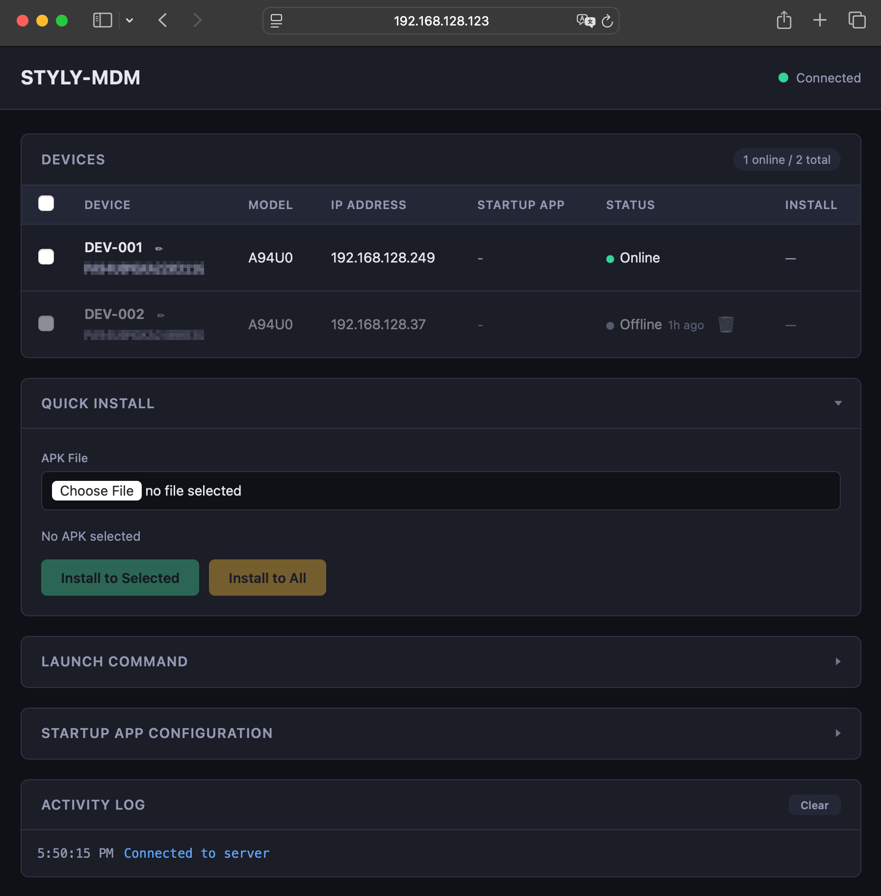

# STYLY-MDM for LBE

A lightweight Mobile Device Management (MDM) system purpose-built for Location Based Experience (LBE) — managing standalone VR headsets deployed at venues, events, and attractions. STYLY-MDM lets you launch applications on one or more HMDs simultaneously from a web browser — no physical access to each headset required.

STYLY-MDM currently supports PICO devices (PICO OS with Business Mode). Support for other device platforms is planned for the future.

> **Note:** STYLY-MDM is designed for use within a local area network (LAN). It does not include any authentication mechanism. Do not expose the server to the public internet.



## Features

- **Multi-device launch** — select devices with the checkboxes (use the header checkbox to select all) and send an app launch command to them at once; offline devices are skipped automatically
- **Persistent device list** — once an HMD has connected it stays in the list with an `online`/`offline` status instead of vanishing on disconnect; offline devices keep their last-known details, can be pre-labeled, and can be forgotten when decommissioned
- **Battery monitoring** — connected clients report battery percentage and charging state, and the console highlights low-battery devices
- **Auto-reconnect with a bounded window** — the web console reconnects automatically with exponential backoff; the MDM client retries (with UDP discovery) only inside a short connection window after a network change or disconnect, then goes fully silent — `Standby (no server found)` — so a fleet running without a server pays no standby-battery or network cost. Toggling Wi-Fi, rebooting, or restarting the client opens a fresh window; the window length and retry interval are configurable via `/sdcard/styly-mdm/config.json` (see [Client standby behavior](#client-standby-behavior-and-how-to-tune-it))
- **Boot persistence** — the MDM client starts automatically on HMD boot via `BOOT_COMPLETED` and PICO auto-boot intents
- **Activity log** — every launch command and result is shown in the web console with timestamps
- **APK deployment** — upload an APK from the web console and install it silently on selected online devices
- **File/folder push** — upload a file or an entire folder and copy it into a directory on selected devices; existing files of the same name are overwritten, nothing else at the destination is touched
- **Folder sync** — mirror a folder into a directory on selected devices, so the destination matches it exactly (new files added, changed files overwritten, **extras removed**). Requires an explicit confirmation, since it deletes. Both actions are limited to shared storage (`/sdcard`)
- **Integrity verification** — on demand, check that an installed APK (or a shared-storage directory) on selected devices matches a local reference; the reference is hashed in your browser (or via the `styly-mdm hash` CLI) with no upload and no HTTPS requirement, and each device shows a ✓/✗ match
- **Client self-update** — push a new MDM client build over MDM itself: the download is verified against server-computed hashes before installing, the device power-cycles itself to recover from the install killing the client, the console shows `updating` (not `offline`) across the restart, and the result — including a post-update integrity check — is reported per device
- **Version visibility & one-click update** — the console shows the running server's STYLY-MDM version in the top bar and each connected device's client build in its row. Compatibility is keyed on `major.minor` — the third ("build") digit is reserved for compatible, independent updates, so a `v0.2.1` server and a `v0.2.0` client count as in sync. A connected client on an older `major.minor` than the server is flagged in **red** as out of sync; when the server holds a newer client APK, an **Update** button on that row reinstalls the client in place (through the self-update flow above). If instead the server trails a connected client, the server version in the top bar turns red. See the [Developer Guide](docs/DEVELOPMENT.md) for the exact compatibility policy
- **Device retirement** — at final handover, remove the MDM client (and its guard app) from selected devices remotely: the client silently uninstalls itself, so no per-device cable work is needed. Remotely irreversible, so the console gates it behind an explicit confirmation; devices that stay silent for the retire window are parked in a terminal `retired` state, and a device that comes back instead is reported as a failed retire
- **Auto-terminate on switch** — the current foreground app is force-stopped before launching a new one, preventing resource conflicts
- **Server discovery** — devices can automatically find the MDM server on the LAN via UDP broadcast (port 7071), eliminating manual URL entry
- **IP address display** — the server logs its LAN IP addresses on startup so you know exactly where to connect

## Getting Started

### Prerequisites

- Python 3.10 or later
- PICO HMD running PICO OS with Business Mode enabled
- The MDM client APK installed on each HMD (see the [Developer Guide](docs/DEVELOPMENT.md) to build it)

### 1. Start the Control Server

Run it without cloning the repository:

```bash
# One-off, no install (recommended):
uvx styly-mdm

# Or install, then run:
pip install styly-mdm
styly-mdm
```

Or run from a clone (for development):

```bash
cd mdm-server
uv sync                  # editable install into .venv
uv run python -m styly_mdm   # or ./run.sh
```

The server starts on port 7070 and displays its LAN IP addresses and the
resolved data-directory paths (handy because the data directory defaults to the
current working directory — see the configuration table below):

```
2026-02-24 [INFO] Starting STYLY-MDM server on port 7070
2026-02-24 [INFO]   Server running at http://192.168.1.5:7070
2026-02-24 [INFO] Configuration:
2026-02-24 [INFO]   Data directory:   /srv/styly-mdm
2026-02-24 [INFO]   APK directory:    /srv/styly-mdm/apks
2026-02-24 [INFO]   Bundle directory: /srv/styly-mdm/bundles
2026-02-24 [INFO]   Device registry:  /srv/styly-mdm/device_registry.json
2026-02-24 [INFO]   WebSocket port:   7070
2026-02-24 [INFO]   Discovery port:   7071
2026-02-24 [INFO] UDP discovery responder listening on port 7071
```

Open `http://<server-ip>:7070` in a browser to access the web console.

**Configuration** — all optional. A command-line flag overrides the corresponding environment variable.

| Setting | Env var | Flag | Default |
|---------|---------|------|---------|
| HTTP/WebSocket port | `MDM_WS_PORT` | `--port` | `7070` |
| UDP discovery port | `MDM_DISCOVERY_PORT` | — | `7071` |
| Data directory (uploaded APKs, pushed bundles, device registry) | `MDM_DATA_DIR` | `--data-dir` | current directory |
| Simultaneous device downloads, server-wide | `MDM_MAX_CONCURRENT_TRANSFERS` | `--max-concurrent-transfers` | `5` |
| Seconds a device may hold a transfer slot | `MDM_TRANSFER_TIMEOUT` | — | `600` |
| Seconds a retiring device must stay silent before the retire counts as done | `MDM_RETIRE_TIMEOUT` | — | `120` |

The **data directory** holds everything the server persists: uploaded APKs (`apks/`), pushed file bundles (`bundles/`), and the device registry (`device_registry.json`). It defaults to the directory the server is started from, so `uvx styly-mdm` in a fresh directory comes up with no devices or groups. Pass `--data-dir` to pin it somewhere stable.

**Transfer throttling** keeps a large fan-out — an APK install, a file push, or a folder sync — from making every device download at the same instant (an APK or a pushed bundle can be up to 2 GiB). All jobs share one server-wide pool: at most `--max-concurrent-transfers` devices download at once; the rest queue, and a slot frees as soon as its device reports the download finished. `MDM_TRANSFER_TIMEOUT` caps how long one device may hold a slot, so a stuck device cannot block the queue. The [Developer Guide](docs/DEVELOPMENT.md) documents the full slot-release rules.

> **Only one server per discovery port.** Devices connect to whichever server answers discovery first, so two servers sharing a discovery port would split them nondeterministically. To prevent that, the server broadcasts a probe on startup and exits if another STYLY-MDM server answers:
>
> ```
> [ERROR] Another STYLY-MDM server is already running on this network and
> responding on discovery port 7071 (from 192.168.1.42). Refusing to start so
> devices cannot connect to the wrong server. Stop the other server, or set
> MDM_DISCOVERY_PORT to a different value to run alongside it.
> ```
>
> To run a development server alongside production, give it its own ports — `mdm-server/run.sh dev` does this by setting `MDM_DISCOVERY_PORT=7081` and `MDM_WS_PORT=7080`. The probe is best-effort: two servers started at the same instant can miss each other.

### 2. Configure the MDM Client

> **Getting the APK.** A released server already holds a matching signed client APK, and the web console's top bar offers it as a **⬇ Client APK v`<version>`** download link — so you can grab the APK for sideloading straight from the console, without visiting this repository's releases page. The link is hidden when the server has no client APK (a from-source run that has never had one uploaded).

Install the MDM client APK on the HMD (see the [Developer Guide](docs/DEVELOPMENT.md) for build and install instructions), then:

1. Launch **STYLY-MDM Client** on the HMD.
2. Choose the connection mode:
   - Tap **Use Auto-Discovery** to clear any manual override and previous discovery
     cache, then immediately start fresh discovery on the LAN.
   - Or enter a manual URL such as `ws://<server-ip>:7070/ws/device`, then tap
     **Save & Connect**. The client keeps this URL separate from discovery results
     and retries only that URL throughout each connection window.

> **Note:** On first launch with no manual URL, the client automatically attempts
> server discovery before falling back to the last discovered or default URL.

The MDM client connects to the server, registers the device (serial number, model, IP address), and runs as a foreground service in the background.

### Client standby behavior (and how to tune it)

The mdm-server does not have to run permanently: at an installed venue it may be
started only when devices actually need to be managed. The client is designed so that
an unreachable server never drains device batteries or puts useless traffic on the
venue network:

- After a network change, an app restart, or losing an established connection, the
  client tries to find a server for a short **connection window** (default **10
  seconds**). Manual mode retries only the saved URL; Auto-Discovery mode starts
  each attempt with discovery and then uses the discovery cache/default URL. Failed
  attempts retry after **2 seconds**. Increase `connect_window_seconds` when the
  server needs longer to boot before accepting connections.
- If no server is found in time, it stops all network traffic and shows
  **`Standby (no server found)`** in its notification and settings screen. A standby
  client sends nothing at all — no reconnect attempts, no discovery broadcasts, no
  pings — so the Wi-Fi radio can stay in power-save and the device pays no
  standby-battery cost for a server that is not there.
- A standby client does **not** notice a server that starts up later. To bring a device
  back under management, give it a new connection window: **toggle Wi-Fi off/on**,
  **reboot the device**, or restart the client app — with the server running.

Both durations can be changed per device by placing an optional JSON file at
`/sdcard/styly-mdm/config.json`:

```json
{ "connect_window_seconds": 10, "connect_retry_interval_seconds": 2 }
```

| Key | Default | Meaning |
|---|---|---|
| `connect_window_seconds` | 10 | How long the client keeps searching before going to standby |
| `connect_retry_interval_seconds` | 2 | Delay between attempts inside the window |

Place it with `adb push` (or the headset's file manager), or deliver it to a connected
fleet with the console's file-push feature. The file is re-read every time a new
connection window opens, so changes take effect on the next Wi-Fi toggle, disconnect,
or reboot — no reinstall needed. Missing or invalid values fall back to the defaults.

### 3. Launch Apps from the Web Console

1. Open `http://<server-ip>:7070` in a browser.
2. Connected HMDs appear in the **Devices** table.
3. Select target devices using the checkboxes (use the header checkbox to select all).
4. Enter the app's **Package Name** (e.g. `com.example.vrapp`) and optional **Extra Data** (JSON string passed to the activity).
5. Click **Launch to Selected**. Offline devices in the selection are skipped automatically.

### 4. Install APKs from the Web Console

1. Open the web console using the server's LAN address, for example `http://192.168.1.5:7070`.
2. Connected HMDs appear in the **Devices** table.
3. Select target devices using the checkboxes (use the header checkbox to select all).
4. In **Install APK**, choose an `.apk` file and click **Upload APK**.
5. After upload completes, click **Install to Selected**. Offline devices in the selection are skipped automatically.

Uploaded APKs are stored under `<data-dir>/apks/` (the data directory defaults to the directory the server is started from; see the configuration table above) and served to devices over the LAN. The MDM client downloads the APK and calls PICO Business SDK's silent install API, so Business Mode and the high-risk API manifest tag are required.

> **All-files access is required.** The PICO ToBService runs as a separate system-user process, so it cannot read APKs from the app's scoped storage — the client must write them to shared storage (`/sdcard/Download/styly-mdm/`). The client therefore declares `MANAGE_EXTERNAL_STORAGE`, which must be granted once per device. Grant it during provisioning with:
>
> ```bash
> adb shell appops set com.styly.mdmclient MANAGE_EXTERNAL_STORAGE allow
> ```
>
> (or toggle **All files access** for the app in the headset's app settings). The client's own settings screen also shows the current grant status and a **Grant All Files Access** button that opens this settings page. Without it, installs fail with `pbsControlAPPManger returned 102: APK does not exist`.

## Migrating to Another Server

Device labels and group definitions live in a single file, `<data-dir>/device_registry.json`. Moving them to another machine is a file copy — there is no export step in the console.

1. **Stop the old server, and make sure the new one is not running yet.** A running server owns the registry file: every label edit, group change, and battery report rewrites it from in-memory state, so a file dropped in underneath a live server is silently overwritten. The old server has to go down anyway — while it is still answering discovery on the same port, the new one refuses to start (see [Configuration](#1-start-the-control-server)).

2. **Copy the registry into the new server's data directory.**

   ```bash
   scp old-host:/path/to/mdm-server/device_registry.json new-host:/srv/styly-mdm/
   ```

3. **Start the new server pointed at that directory.**

   ```bash
   styly-mdm --data-dir /srv/styly-mdm
   ```

Devices do **not** reconnect on their own: while the old server was down they went to
standby (see [Client standby behavior](#client-standby-behavior-and-how-to-tune-it)),
and a standby client does not notice the new server. Once the new server is running,
toggle Wi-Fi off/on or reboot each headset — the fresh connection window rediscovers
the new server over UDP and reconnects. The `ip` and `last_seen` fields refresh on
reconnect, and group membership is keyed by serial number, so devices that are offline
during the move keep their groups.

Uploaded APKs (`<data-dir>/apks/`) and pushed file bundles (`<data-dir>/bundles/`) are not part of the registry. Copy those directories separately with `rsync` or `scp` if the new server needs them — a single APK can be up to 2 GiB, so they are not worth moving through a browser.

## Documentation

- **[Developer Guide](docs/DEVELOPMENT.md)** — architecture, build instructions, project structure, WebSocket / discovery protocol references, client permissions, and the client/server version-compatibility policy.
