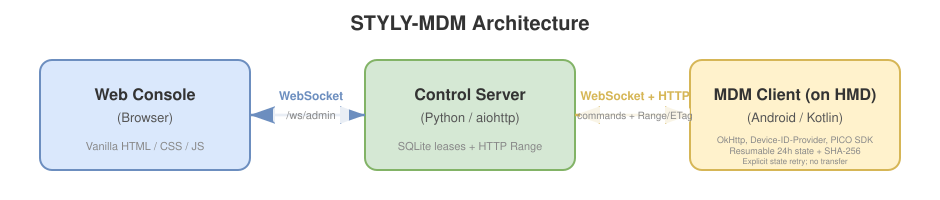
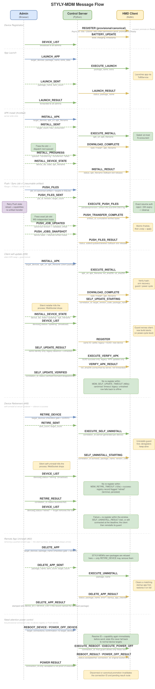

# Developer Guide

Developer-oriented documentation for STYLY-MDM: build instructions, project layout, and protocol references.

For end-user setup and usage, see the [README](../README.md).

## Architecture



| Component | Location | Technology |
|---|---|---|
| Control Server | `mdm-server/styly_mdm/` | Python 3.10+, aiohttp |
| MDM Client | `mdm-client/` | Kotlin, OkHttp, PICO Business SDK |
| Web Console | `mdm-server/styly_mdm/static/` | Vanilla HTML / CSS / JS |

## Message Flow



## Building the MDM Client

### Build from CLI

```bash
cd mdm-client
./build.sh                # prod debug (default)
./build.sh release        # prod release
./build.sh debug dev      # dev debug   — separate discovery port (see below)
./build.sh release dev    # dev release
```

Usage: `./build.sh [debug|release] [prod|dev]` (defaults: `debug prod`).

The generated APK is output to `mdm-client/app/build/outputs/apk/<flavor>/<type>/`,
e.g. `apk/prod/debug/app-prod-debug.apk` or `apk/dev/debug/app-dev-debug.apk`.

Gradle properties, for self-update testing (see [Client Self-Update](#client-self-update)):

| Property | Default | Purpose |
|---|---|---|
| `-PversionCodeOverride=N` | `versionCode` in `app/build.gradle` | Push a strictly-increasing `versionCode` without editing the file |
| `-PversionNameOverride=S` | `versionName` in `app/build.gradle` | Label a one-off build |
| `-PguardVersionCodeOverride=N` | `versionCode` in `guard/build.gradle` | Same, for the guard app (`./gradlew :guard:assembleDebug`) |
| `-PguardVersionNameOverride=S` | `versionName` in `guard/build.gradle` | Same, for the guard app |
| `-PguardClientPackageOverride=P` | `com.styly.mdmclient` | Point the guard at a package that does not exist, to exercise stand-down/self-destruct without uninstalling the real client |
| `-PguardSelfDestructGraceMsOverride=N` | `600000` (10 min) | Shorten the self-destruct grace for that test |
| `-PguardDeadmanMsOverride=N` | `3600000` (60 min) | Shorten the guard's deadman-alarm interval for that test |

### Build from Android Studio

1. Open the `mdm-client/` directory in Android Studio.
2. Run `Build → Build Bundle(s) / APK(s) → Build APK(s)`.

### Install the APK

```bash
adb install mdm-client/app/build/outputs/apk/prod/debug/app-prod-debug.apk
```

> **Dev Container:** A ready-to-use build environment is provided via [Dev Containers](https://containers.dev/). Open this repository in VS Code with the Dev Containers extension (or GitHub Codespaces) and all prerequisites (JDK 17, Android SDK 33, build-tools, Gradle) are set up automatically — no local installation needed.

## Running a Dev Environment Alongside Production

Only one production server may exist per LAN (clients connect to the first server
that answers discovery). During development you often want a separate dev server and
dev client on the **same** network without disturbing production. The `dev` build
flavor and a pair of server environment variables isolate the two by using different
ports, so neither environment discovers the other.

| Environment | Discovery port | WebSocket port | Client build (label) |
|---|---|---|---|
| Production (default) | 7071 | 7070 | `prod` flavor — "STYLY-MDM Client" |
| Development (`dev` flavor) | 7081 | 7080 | `dev` flavor — "STYLY-MDM Dev" |

Both flavors share the applicationId `com.styly.mdmclient`, so they **cannot be
installed at the same time** — installing the dev build replaces the production build
on a device. Run the dev client on a dedicated test device, or accept that it replaces
production while you test. Isolation between the two environments is purely by port, so
a dev client/server never discovers a production one even on the same LAN.

**Dev server** — start with the `dev` argument, which sets the dev ports for you:

```bash
cd mdm-server
./run.sh dev      # dev ports (7081 / 7080); ./run.sh (or "prod") uses production ports
```

`run.sh dev` simply exports `MDM_DISCOVERY_PORT=7081` / `MDM_WS_PORT=7080` before
launching the server (`python -m styly_mdm`). You can still set those variables
yourself if you prefer. When unset, the server falls back to the production ports,
so production startup is unchanged.

**Dev client** — build the `dev` flavor:

```bash
cd mdm-client
./build.sh debug dev      # or: ./build.sh release dev
adb install app/build/outputs/apk/dev/debug/app-dev-debug.apk
```

The dev APK keeps the production applicationId `com.styly.mdmclient` and only changes
its label to **STYLY-MDM Dev**, so installing it replaces the production build on a
device (they share a package name and cannot coexist). It only broadcasts/listens on
the dev discovery port (7081), so it never discovers the production server. Its
fallback URL also targets the dev WebSocket port (7080), so even if discovery times
out it cannot accidentally connect to a production server.

The ports come from `BuildConfig` fields defined per flavor in
`mdm-client/app/build.gradle` (`DISCOVERY_PORT`, `DEFAULT_WS_PORT`).

> **Device owner:** because dev and prod share an applicationId, a device only ever has
> one STYLY-MDM install, so there is never a dev-vs-prod device-owner conflict on a
> single device. Updating a device-owner production install in place with a dev build
> of the **same signing key** preserves device-owner status; a differently signed dev
> build (e.g. debug over a release install) must be uninstalled first, which clears
> device-owner status, so you would need to re-provision.

### Seeding dummy devices for UI testing

`mdm-server/scripts/seed_dummy_devices.py` populates a **running** server with fake
devices, so you can exercise console UI that only matters at scale — the Manage Groups
device list scrolling, and the Devices-list / group-picker **filter and sort** controls
(filter matches the device name/label; sort by device name, ascending or descending). It
is a dev-only helper and is not shipped in the wheel.

It registers through the live `/ws/device` WebSocket rather than editing
`device_registry.json`, because a running server owns that file: any register/battery/
group change triggers `save_registry()`, which rewrites the file from in-memory state
and would clobber a hand-edit. Going through the socket makes the server itself persist
the dummies.

```bash
cd mdm-server
python scripts/seed_dummy_devices.py 20            # add 20 offline dummy devices
python scripts/seed_dummy_devices.py 20 --online   # keep them connected (online) until Ctrl-C
python scripts/seed_dummy_devices.py --remove      # forget every dummy this tool created
```

The port is found by UDP discovery (so it works against a `run.sh dev` server on
7080/7081 as well as a default 7070/7071 one); pass `--port` to target it explicitly.
Repeated runs continue numbering, so counts add up; dummies use the serial prefix
`DUMMY-TEST-` (override with `--prefix`) and are removed by that prefix. Only offline
devices can be forgotten, so stop an `--online` run before `--remove`.

## Project Structure

```
STYLY-MDM/
├── mdm-server/
│   ├── pyproject.toml       # Packaging metadata (published to PyPI as styly-mdm)
│   ├── run.sh               # Dev/prod launcher (python -m styly_mdm)
│   ├── scripts/             # Dev-only helpers (not packaged)
│   │   └── seed_dummy_devices.py  # Add/remove fake devices on a running server
│   ├── styly_mdm/           # Installable package
│   │   ├── __init__.py      # Exports create_app / main
│   │   ├── __main__.py      # `python -m styly_mdm` entrypoint
│   │   ├── server.py        # WebSocket control server (aiohttp) + `styly-mdm hash` CLI
│   │   ├── integrity.py     # APK CD-digest + directory tree-hash (integrity reference)
│   │   └── static/
│   │       └── index.html   # Web management console (bundled package data)
│   └── tests/
│       └── test_app.py      # Smoke tests
└── mdm-client/
    ├── app/src/main/
    │   ├── AndroidManifest.xml
    │   └── java/com/styly/mdmclient/
    │       ├── MdmClientApplication.kt   # Application entry point
    │       ├── MdmClientService.kt       # Foreground service; executes launch commands
    │       ├── WebSocketManager.kt       # WebSocket connection with auto-reconnect
    │       ├── SettingsActivity.kt       # UI to configure server URL; shows client build; Update Journal viewer
    │       ├── ServerDiscovery.kt        # UDP broadcast server discovery
    │       ├── BundleSync.kt             # Push/sync a file bundle into a device directory
    │       ├── UpdateJournal.kt          # Persistent event log; survives a self-update kill
    │       ├── UpdateJournalCodec.kt     # Journal serialization (unit-tested on the host JVM)
    │       ├── InstallPolicy.kt          # Hash gate for downloaded APKs (host-JVM tested)
    │       ├── GuardLink.kt              # Client half of the mutual watch with the guard app
    │       ├── PowerCycleSchedule.kt     # Shutdown/startup times for a self-update (host-JVM tested)
    │       ├── PowerCycleTimers.kt       # Arms/disarms the PICO timing APIs (self-update fallback)
    │       └── BootReceiver.kt           # Auto-start on device boot
    └── guard/src/main/
        └── java/com/styly/mdmguard/
            ├── GuardService.kt           # Watchdog: revives a dead client via TobService
            ├── DeadmanReceiver.kt        # Alarm target that restarts the watchdog itself
            └── BootReceiver.kt           # Auto-start on device boot
```

## WebSocket Protocol Reference

### Device → Server

| Message type | Description |
|---|---|
| `REGISTER` | Sent on connect. Fields: `device_id`, `model`, `ip`, `version_code` (integer), `version_name`, `startup_app` (optional) |
| `BATTERY_UPDATE` | Battery telemetry. Fields: `device_id`, `level` (integer 0-100), `charging` (boolean), `timestamp` (epoch seconds) |
| `LAUNCH_RESULT` | Result of an app launch. Fields: `status` (`success`/`fail`), `package_name`, `error` (optional) |
| `INSTALL_RESULT` | Result of an APK install. Fields: `status` (`success`/`fail`), `apk_filename`, `result_code` (optional), `error` (optional) |
| `DOWNLOAD_COMPLETE` | Sent right after a download finishes, before the local work it feeds (the install, or the unzip + mirror). Frees the server's transfer slot so the next queued device can start downloading. Fields: `task` (`install` / `push`; absent means `install`), `apk_filename` (install), `dest_path` + `delete_extras` (push). Optional — see the transfer-throttling note below. |
| `PUSH_FILES_RESULT` | Result of a push or sync. Fields: `status` (`success`/`fail`), `dest_path`, `added`, `updated`, `deleted` (counts; `deleted` is always 0 for a push), `error` (optional) |
| `VERIFY_APK_RESULT` | Result of an APK integrity check. Fields: `package_name`, `found` (boolean), `size`, `cd_sha256`, `full_sha256`, `version_code`, `version_name`, `signer_sha256`, `error` (optional). Absent hash/version fields when `found` is false. |
| `VERIFY_DIR_RESULT` | Result of a directory integrity check. Fields: `path`, `found` (boolean), `tree_hash`, `file_count`, `total_size`, `manifest` (optional array of `{relative_path, size, sha256}`, omitted above a cap), `error` (optional) |
| `SELF_UPDATE_STARTING` | The client's last words before the silent installer kills its process for a self-update: tells the server to treat the coming disconnect as `updating`, not `offline`. Fields: `correlation_id`, `target_version_code`, `current_version_code`, `package_name`, `apk_filename`. See [Client Self-Update](#client-self-update). |
| `SELF_UNINSTALL_STARTING` | The client's last words before uninstalling itself for a retire: tells the server to treat the coming disconnect as `retiring` and to read permanent silence as success. Fields: `correlation_id` (echoed from `EXECUTE_SELF_UNINSTALL`), `package_name`, `version_code`. See [Device Retirement](#device-retirement). |
| `SELF_UNINSTALL_RESULT` | Only ever a failure report — a successful self-uninstall leaves no process to send anything. Fields: `correlation_id`, `status` (always `fail`), `detail`, `result_code` (optional) |

### Server → Device

| Message type | Description |
|---|---|
| `EXECUTE_LAUNCH` | Launch an app. Fields: `package_name`, `extra` |
| `EXECUTE_INSTALL` | Download and install an APK. Fields: `apk_url`, `apk_filename`, plus `full_sha256` + `cd_sha256` (reference hashes of the file being dispatched; present only when the APK is a local upload in `apks/`). The client verifies the download against `full_sha256` before installing; a **self**-update is refused outright when the hashes are absent. |
| `EXECUTE_PUSH_FILES` | Download a bundle and apply it to a directory. Fields: `bundle_url`, `bundle_filename`, `dest_path`, `delete_extras` (boolean; `false` = copy/overwrite only, `true` = full mirror. Read with a `false` default — a missing field must never delete) |
| `EXECUTE_VERIFY_APK` | Compute `size` + Central-Directory digest (plus diagnostics) for an installed package. Fields: `package_name` |
| `EXECUTE_VERIFY_DIR` | Compute a manifest + tree hash for a device directory (shared storage only). Fields: `path` |
| `EXECUTE_SELF_UNINSTALL` | Uninstall the guard, announce `SELF_UNINSTALL_STARTING`, then silently uninstall the client itself (venue handover). Fields: `correlation_id` (server-generated per device, echoed back by the announcement) |

### Admin → Server

| Message type | Description |
|---|---|
| `LAUNCH_APP` | Launch an app on target devices. Fields: `target_devices` (list of device IDs or `["*"]`), `package_name`, `extra_data` |
| `INSTALL_APK` | Install an uploaded APK on target devices. Fields: `target_devices` (list of device IDs or `["*"]`), `apk_url`, `apk_filename` |
| `PUSH_FILES` | Apply a bundle to a directory on target devices. Fields: `target_devices` (list of device IDs or `["*"]`), `bundle_url`, `bundle_filename`, `dest_path`, `delete_extras` (boolean, optional; only a literal `true` requests a full mirror) |
| `VERIFY_APK` | Verify an installed package against a local reference on target devices. Fields: `target_devices`, `package_name`. The reference (`size` + CD digest) is computed and compared in the browser and is **never** sent to the server. |
| `VERIFY_DIR` | Verify a device directory against a local reference on target devices. Fields: `target_devices`, `path` (absolute, within shared storage). |
| `GET_DEVICE_LIST` | Request the current device list |
| `CREATE_GROUP` | Create a new, empty device group. Fields: `name` |
| `RENAME_GROUP` | Rename a group, preserving its members. Fields: `name`, `new_name` |
| `DELETE_GROUP` | Delete a group (member devices are not affected). Fields: `name` |
| `SET_DEVICE_GROUPS` | Set the exact set of groups a device belongs to. Fields: `device_id`, `groups` (list of existing group names) |
| `SET_GROUP_MEMBERS` | Set the exact member list of an existing group (group-centric). Fields: `name`, `members` (list of serials; offline/unknown serials allowed) |
| `RETIRE_DEVICE` | Make target clients uninstall themselves (remotely irreversible — the console gates it behind its heaviest confirmation). Fields: `target_devices` (list of device IDs or `["*"]`; online devices only). See [Device Retirement](#device-retirement). |

### Admin HTTP API

| Endpoint | Description |
|---|---|
| `POST /api/apks` | Multipart upload with field `apk`. Returns `apk_url`, `apk_filename`, and `size`. |
| `GET /apks/{filename}` | Serves uploaded APK files to devices on the LAN. |
| `POST /api/bundles` | Multipart upload with repeated field `files`; each part's filename carries its folder-relative path. The server zips the reconstructed tree into a bundle, excluding OS metadata (`.DS_Store`, `._*`, `Thumbs.db`, …). Returns `bundle_url`, `bundle_filename`, `size`, `entry_count` (files in the bundle), and `skipped_count` (files excluded). 400 if every uploaded file was excluded. |
| `GET /bundles/{filename}` | Serves generated file/folder bundles (zip) to devices on the LAN. |

### Server → Admin

| Message type | Description |
|---|---|
| `SERVER_INFO` | Server identity, sent once on connect (before the first `DEVICE_LIST`). Fields: `version` (the `styly_mdm` package version; the console renders it next to the `STYLY-MDM` brand in the top bar. Its `major.minor` is the compatibility reference — and the top-bar value itself turns red when a live client is on a *newer* `major.minor` (i.e. the server is the one lagging). See the compatibility note below). |
| `CLIENT_APK_INFO` | The newest styly-mdm-client APK the server holds, sent on connect (right after `SERVER_INFO`, before `DEVICE_LIST`) and re-broadcast after every APK upload. Field: `apk` = `{filename, url, version}` or `null`. Drives the per-device **Update** button (see the client-update note below). |
| `DEVICE_LIST` | Current list of known devices. Fields: `devices` (array; each entry carries `status` (`online` / `offline` / `updating` — while a self-update's recovery is in flight — / `retiring` — announced a self-uninstall, awaiting the retire window — / `retired` — terminal, persisted after a successful retire), `version_code` / `version_name` (the client build, when known — the console renders it as a right-aligned badge per row, or `unknown` for clients that predate version reporting; a *stable-online* client whose `version_name` trails the server on `major.minor` is flagged red as needing an update — the reverse case, a client *ahead* of the server, reddens the top-bar server version instead. `updating` and offline rows are exempt, and the check is skipped only when the server version is the `0.0.0` untagged/not-installed fallback), and may include optional `battery`: `{level, charging, last_seen}`) |
| `LAUNCH_SENT` | Confirmation that commands were dispatched. Fields: `package_name`, `sent_count`, `target_count` |
| `INSTALL_SENT` | Confirmation that an install job was accepted (dispatch is throttled and runs in the background). Fields: `apk_filename`, `apk_url`, `target_count`, `max_concurrent` |
| `INSTALL_PROGRESS` | Live progress of a throttled install job, broadcast on each transfer-slot transition. Fields: `apk_filename`, `apk_url`, `total`, `queued`, `transferring`, `transferred`, `failed`, `done` (boolean, `true` on the final update) |
| `INSTALL_DEVICE_STATE` | Per-device companion to `INSTALL_PROGRESS`: names the devices that just entered a state, so the console can label each row instead of showing the whole target set as installing. Fields: `device_ids` (array), `state` (`queued` / `transferring` / `installing` / `updating` / `success` / `fail`; `updating` and its terminal `success`/`fail` are emitted only for a client self-update), `apk_filename`, `detail` (failure reason, may be empty) |
| `PUSH_FILES_SENT` | Confirmation that a push/sync job was accepted (dispatch is throttled and runs in the background). Fields: `bundle_filename`, `dest_path`, `delete_extras`, `target_count`, `max_concurrent` |
| `PUSH_PROGRESS` | The `INSTALL_PROGRESS` twin for a push/sync job. Fields: `bundle_filename`, `dest_path`, `delete_extras`, `total`, `queued`, `transferring`, `transferred`, `failed`, `done` |
| `PUSH_DEVICE_STATE` | The `INSTALL_DEVICE_STATE` twin. Fields: `device_ids` (array), `state` (`queued` / `transferring` / `applying` / `fail`), `dest_path`, `delete_extras` (so the console can name the action), `detail` |
| `PUSH_FILES_RESULT` | Forwarded file/folder result from a device (adds `device_id`) |
| `LAUNCH_RESULT` | Forwarded result from a device |
| `INSTALL_RESULT` | Forwarded install result from a device |
| `VERIFY_SENT` | Confirmation that verify-APK commands were dispatched. Fields: `package_name`, `sent_count`, `target_count` |
| `VERIFY_DIR_SENT` | Confirmation that verify-directory commands were dispatched. Fields: `path`, `sent_count`, `target_count` |
| `VERIFY_APK_RESULT` / `VERIFY_DIR_RESULT` | Forwarded integrity result from a device (stamped with `device_id`). The console compares it against the local reference. Exception: the `VERIFY_APK_RESULT` answering a self-update auto-verify is consumed by the server (which holds the reference) and surfaces as `SELF_UPDATE_VERIFIED` instead. |
| `SELF_UPDATE_RESULT` | Outcome of a client self-update, settled when the device re-registers (or the window expires). Fields: `device_id`, `correlation_id`, `status` (`success` / `fail` / `timeout`), `version_code` (what the device came back with; `null` on timeout), `target_version_code`, `detail` |
| `SELF_UPDATE_VERIFIED` | Outcome of the automatic post-update `EXECUTE_VERIFY_APK` the server runs against the client's own package. Fields: `device_id`, `correlation_id`, `status` (`verified` / `mismatch` / `skipped` / `error`), `detail` |
| `RETIRE_SENT` | Confirmation that `EXECUTE_SELF_UNINSTALL` commands were dispatched. Fields: `sent_count`, `target_count` |
| `RETIRE_RESULT` | Outcome of a device retire. Success is settled by *silence*: the device announced, disconnected, and stayed away for the retire window. Failure means it re-registered, reported the uninstall failed, or was still connected at the deadline. Fields: `device_id`, `correlation_id`, `status` (`success` / `fail`), `detail` |
| `GROUP_LIST` | Current device groups. Fields: `groups` (object mapping group name → array of member serials). The console derives each device's group membership from this; sent on connect and after any group change. |
| `GROUP_CREATED` / `GROUP_RENAMED` / `GROUP_DELETED` | Acknowledgements for group create / rename / delete. |
| `DEVICE_GROUPS_SET` | Acknowledgement of a device's group membership change. Fields: `device_id`, `groups` |
| `GROUP_MEMBERS_SET` | Acknowledgement of a group's member list change. Fields: `name`, `members` |
| `ERROR` | Error message. Fields: `message` |

> **Client/server compatibility** is keyed on `major.minor`. Policy: any change
> that requires the client and server to move together (a wire-protocol or shared
> behaviour change) **must** bump the minor (or major) version; the third
> component ("build") is reserved for compatible, independent updates. This lets a
> server ship a build-only patch — e.g. `v0.2.1` server against an unchanged
> `v0.2.0` client — without the console flagging the fleet as out of sync. The
> console applies exactly this rule, comparing only `major.minor` numerically
> (`0.10` > `0.2`): a live client **behind** the server reddens that device's
> badge (it needs updating), while a client **ahead** of the server reddens the
> top-bar server version (the server is the one lagging).

> **Client update (self-update) from the console.** Next to a red (behind) badge,
> when the server holds a client APK newer than that device, the console shows an
> **Update** button. It reuses the ordinary install path (`INSTALL_APK` targeting
> the single device with the client APK's url) — the device recognises its own
> package and drives the self-update handshake (`SELF_UPDATE_STARTING` → re-register
> → verify). The server identifies its client APK by the release naming convention
> `styly-mdm-client_<version>.apk` (`.github/workflows/release.yml`); the newest one
> in `APK_DIR` wins (numeric compare; ties by mtime). That APK gets there two ways:
> an operator upload, or the **signed** client APK **bundled in the wheel** under
> `styly_mdm/client/` (package-data) and copied into `APK_DIR` on startup by
> `seed_bundled_client_apk()` — so a matching client is available out of the box. The
> bundled APK must be the signed release build: Android rejects an update signed with
> a different key. (CI wiring to embed the `release.yml`-built signed asset into the
> wheel before the build is a pending follow-up; until then the bundled copy is absent
> and the button lights up only from an operator upload of a correctly-named APK.)

> **Device groups** are a many-to-many grouping keyed by device serial, persisted
> server-side in `device_registry.json` (under a `groups` key). Selecting a group
> in the console is a client-side convenience: it sets the device selection to that
> group's members (devices not in the group are deselected), so commands still
> dispatch via the normal `target_devices` path (online members only). Group
> membership can include offline devices.

> **Battery telemetry** is optional for backwards compatibility. Older clients
> that never send `BATTERY_UPDATE` remain valid; their device rows simply omit
> `battery`. New clients send one update immediately after WebSocket connect and
> then every 5 minutes while the foreground service is running. The server stores
> the latest battery state in `device_registry.json`, so offline devices retain
> their last-known battery percentage and charging state.

> **Transfer throttling.** An `INSTALL_APK` or a `PUSH_FILES` targeting a large group
> would otherwise make every device pull the file from the server at the same instant
> (an APK can be up to 2 GiB, a push bundle likewise), spiking LAN/server bandwidth.
> Instead the server owns a pool of **N** transfer slots
> (`MDM_MAX_CONCURRENT_TRANSFERS` env var / `--max-concurrent-transfers` flag,
> default **5**) and every byte-moving fan-out — install, push, sync — must take one
> before it dispatches. Remaining targets are queued; each slot frees as soon as its
> device signals the download finished, and the next queued device is dispatched.
>
> The pool is **server-wide, not per job**. The throttle belongs to the transfer
> *resource* (the LAN, the server's uplink), not to any one action: a per-job
> semaphore would let two overlapping install jobs run 2N transfers, and would leave a
> concurrent install and push blind to each other's bytes. `transfer_slots()` builds
> the semaphore lazily on first use and never resizes it — swapping in a larger one
> would strand the coroutines already parked on the old object and briefly allow twice
> the cap.
>
> Slot-release triggers, in order of preference:
>
> 1. `DOWNLOAD_COMPLETE` from the client (primary — releases the moment the
>    network-heavy download ends, so the local install / unzip + mirror proceeds off
>    the critical path).
> 2. The terminal result — `INSTALL_RESULT` or `PUSH_FILES_RESULT` (fallback — covers
>    older clients that never emit `DOWNLOAD_COMPLETE`, and clients whose download
>    failed outright).
> 3. Device disconnect (frees every slot the device held, immediately).
> 4. A per-device timeout (`MDM_TRANSFER_TIMEOUT` seconds, default **600**) so a
>    silent/stuck device cannot block the queue. Lowering it recovers stuck slots
>    sooner but risks releasing a slow-but-healthy transfer early, which only
>    relaxes throttling and never drops the job itself.
>
> `pending_transfers` is keyed by **`(device_id, task)`**, not by device: an admin can
> push files to a group that is already installing an APK, so one device may hold an
> install slot and a push slot at once. Each terminal message frees only its own task's
> slot; only a disconnect is task-agnostic.
>
> This is fully backward compatible in both directions. An older client that never
> emits `DOWNLOAD_COMPLETE` for a push still frees its slot via `PUSH_FILES_RESULT` or
> the timeout, and one that omits the `task` field is read as `install`, exactly as
> before. An older server simply logs the message as unknown (pre-#35) or treats it as
> an install release (pre-#44) — at worst that frees an install slot early, which only
> relaxes throttling.
>
> Admins see aggregate progress via `INSTALL_PROGRESS` / `PUSH_PROGRESS` (queued /
> transferring / transferred / failed counts).

> **Per-device transfer state.** `INSTALL_PROGRESS` / `PUSH_PROGRESS` carry only
> aggregate counts, which cannot be mapped back to rows, so the server also broadcasts
> `INSTALL_DEVICE_STATE` / `PUSH_DEVICE_STATE` as each device moves. The console's
> PROGRESS column shows `Waiting…` → `Transferring…` → `Installing…` / `Pushing…` /
> `Syncing…` → `✓ installed` / `✓ pushed` / `✓ synced` / `✗ failed`, which is what
> distinguishes a device queued behind a transfer slot from one that is genuinely
> working.
>
> Which side emits which state is deliberate:
>
> | State | Emitted by |
> |---|---|
> | `queued` | the job, once for the whole target list |
> | `transferring` | the dispatcher, right after `EXECUTE_INSTALL` / `EXECUTE_PUSH_FILES` is sent |
> | `installing` / `applying` | the `DOWNLOAD_COMPLETE` **message handler** |
> | `fail` | the dispatcher (offline before its turn, failed dispatch, timeout) |
> | `success` / `fail` | the forwarded terminal `INSTALL_RESULT` / `PUSH_FILES_RESULT` |
>
> `installing` (and its push twin `applying`, which covers the client's local unzip and
> mirror) must come from the message handler rather than the dispatcher coroutine
> resuming from its released future: the coroutine's resumption would race the receive
> loop processing the client's subsequent terminal result, and if `installing` landed
> last the row would spin forever. Handling it in the receive loop makes the order
> structural, since a WebSocket preserves per-connection order.
> `release_transfer_slot()` returns whether it actually freed a live slot, so a
> `DOWNLOAD_COMPLETE` arriving after a transfer already timed out cannot resurrect
> `installing` on a device the job has written off.

> **Push files: two actions, one transport.** The console uploads a file or a whole
> folder to `POST /api/bundles`; the server reconstructs the tree and zips it into a
> single bundle served from `/bundles/`, dropping OS-generated metadata on the way in
> (see below). `PUSH_FILES` carries the bundle URL, a
> destination directory, and `delete_extras`. The client downloads the bundle, unzips
> it (with a zip-slip guard), and applies it to the destination — how it applies is
> the whole distinction:
>
> | Console action | `delete_extras` | Semantics |
> |---|---|---|
> | **Push Files** (file or folder) | `false` | Copy and overwrite. Nothing at the destination is removed; `deleted` is always 0. |
> | **Sync Folder** (folder only) | `true` | Full mirror: extras at the destination — including now-empty directories — are deleted, so it ends up identical to the bundle (`rsync --delete` semantics). |
>
> These are two console panels rather than one panel with a delete toggle so the
> destructive operation has to be chosen **by name**. Only Sync Folder shows the
> warning and requires the "extras will be deleted" confirmation.
>
> The delete lives in exactly one place: `BundleSync.apply` in the client, gated on
> `deleteExtras`. Everything else — the server's `handle_push_files`, the bundle
> build — is identical for both actions and merely passes the flag through. That flag
> is decoded defensively at both boundaries: the server treats only a literal `true`
> as a delete request (`data.get("delete_extras") is True`), and the client reads it
> with `optBoolean(..., false)`. **A missing or malformed field can only ever copy.**
> Since the delete is client-side, the non-destructive Push only exists on devices
> running an APK that has this change — an older client mirrors whatever it is sent.
> `BundleSync` is deliberately Android-free so `app/src/test/.../BundleSyncTest.kt`
> can prove both branches on the host JVM (`./gradlew :app:testProdDebugUnitTest`).
>
> **Excluded from every bundle.** A folder pick drags along whatever the OS left in it —
> a `.DS_Store` per directory, an `._name` AppleDouble sidecar per file once the folder has
> been through a USB stick, `Thumbs.db`, `desktop.ini`. `is_excluded_bundle_entry` drops
> these in `upload_bundle_handler`, before anything is written to staging, so they never
> reach the zip, never count against `MAX_BUNDLE_ENTRIES`, and never land on a device.
> Matching is case-insensitive and applies to *any* path segment, so an excluded directory
> (`.Spotlight-V100`, `__MACOSX`, `$RECYCLE.BIN`, `.Trash-1000`) takes its contents with it.
>
> The list is deliberately confined to files an OS creates on its own. `.git/`, Unity
> `.meta` files, and dotfiles at large are uploaded as-is: silently dropping content a user
> authored would be a worse failure than shipping an unwanted `.DS_Store`. An upload that is
> *entirely* metadata is rejected with 400 rather than producing an empty bundle — a Sync
> Folder given an empty bundle would wipe the destination. Since the console's pre-upload
> file count comes from the browser and the post-upload count comes from the server, the
> upload response returns `skipped_count` and the console logs what was excluded rather than
> letting the two numbers silently disagree.
>
> Because a mirror deletes, and because the PICO ToBService exposes **no privileged
> file-copy API**, two constraints apply to both actions and are enforced on the
> server (syntactic) and the client (canonical): the destination must live under
> **shared/primary external storage** (`/sdcard` · `/storage/emulated/0`) — the
> client can only reach shared storage with `java.io.File` I/O, so app-scoped
> `Android/data/<pkg>/` directories are *not* targetable — and it must be neither
> the storage root nor a protected top-level directory (`Android`, `Download(s)`,
> `DCIM`, `Pictures`, `Movies`, `Music`, `Documents`, `Alarms`, `Notifications`,
> `Podcasts`, `Ringtones`) so a mistyped path cannot wipe unrelated user/media data.
>
> Both actions reuse the per-device PROGRESS column, showing `Waiting…` →
> `Transferring…` → `Pushing…` / `Syncing…` → `✓ pushed` / `✓ synced` (with the
> `+added ~updated -deleted` summary) / `✗ failed`. Like install, these transitions are
> server-driven (`PUSH_DEVICE_STATE`), because the bundle transfer draws on the same
> server-wide slot pool and the server therefore knows where each device is. A device
> that drops offline mid-job clears its cell on the next `DEVICE_LIST`.
> `PUSH_FILES_RESULT` does not name the mode, so the console carries the verb over from
> the `delete_extras` that rode along on the preceding `PUSH_DEVICE_STATE` (a page
> reloaded mid-job falls back to "pushed"). The column holds one state per device, so a
> push, an install and a verify targeting the same device overwrite each other's cell —
> the last transition received wins, even though a push and an install hold independent
> transfer slots. That state lives in `deviceTaskState[id] = {task, status, …}` and is
> painted by `taskCellHtml()`; the log keeps the full history of every job regardless.

## Integrity Verification

On-demand check that a package (or a directory) on a managed device matches a
reference the operator holds locally. The **reference is computed client-side**
(in the browser, or with the `styly-mdm hash` CLI) and the **comparison happens
client-side**; the server only relays the `VERIFY_*` messages (it never hashes).
This keeps two hard constraints: a 1 GB+ APK is **never uploaded** just to be
checked, and no HTTPS/secure-context is required — the browser hashing is pure JS
(`crypto.subtle` is unavailable over plain `http://<LAN-IP>`).

Verdicts appear in the same per-device **PROGRESS column** as install and push
(`⟳ Verifying…` → `✓ match` / `✗ mismatch` / `✗ not found` / `✗ error`), so the mismatching
headset is identified in the device row rather than in a separate list. The column is too
narrow for `missing 3 · added 0 · changed 1`, so that detail is carried in the cell's
`title` tooltip and written to the log, which keeps every verdict even after a later job
overwrites the cell.

The reference, browser, and device implementations must agree byte-for-byte, so
the algorithms below are a fixed spec (the canonical Python implementation is
`mdm-server/styly_mdm/integrity.py`).

**APK (`VERIFY_APK`) — `size` + Central-Directory digest.** An APK is a ZIP; its
tail holds the Central Directory (every entry's CRC-32 + sizes). `cd_sha256` is the
SHA-256 of `file[CD_offset .. EOF]`, where `CD_offset` is the little-endian uint32 at
offset 16 of the End-Of-Central-Directory record (the last `PK\x05\x06` whose
`position + 22 + comment_length == file_length`). This covers every entry while
reading only a few hundred KB regardless of APK size. A device match requires
`found && size == reference.size && cd_sha256 == reference.cd_sha256`. The device also
returns `full_sha256` (whole-file, hardware-accelerated), `version_code`,
`version_name`, and `signer_sha256` (SHA-256 of the current signing certificate) as
diagnostics shown on a mismatch. ZIP64 archives (CD offset sentinel `0xFFFFFFFF`) are
not supported and return a clear error rather than a wrong range.

Picking a reference APK also **auto-fills the package name** to verify. The console
reads `AndroidManifest.xml` out of the picked file (Central Directory → Local File
Header → stored as-is or inflated with `DecompressionStream('deflate-raw')`, which,
unlike `crypto.subtle`, works on a non-secure origin) and parses the binary AXML for
the `<manifest>` element's `package` and `versionName`. Both storage forms occur in
practice: Unity release APKs store the manifest, Gradle debug APKs deflate it, and the
AXML string pool may be UTF-8 or UTF-16. This is a progressive enhancement — on any
parse failure the console logs a warning and the field falls back to manual entry.
A name the operator typed is never overwritten by a failed parse, but one the console
filled in from a *previous* APK is cleared, so a reference can never be verified
against a stale package name.

*Known limitation (accepted):* `size` + CD digest does not detect in-place data
corruption that preserves the stored CRC-32 (ZIP CRCs are build-time constants). This
is rare — Android verifies the APK signature at install. `full_sha256` is already
returned for a future byte-exact "strict" mode. Phase 1 targets the single `base.apk`
(`sourceDir`); split-APK combination is a possible future extension.

**Directory (`VERIFY_DIR`) — manifest + tree hash.** For each regular file the device
records `{relative_path, size, sha256}` (paths forward-slashed, relative to the target
directory), sorts entries by the **UTF-8 byte order** of `relative_path`, and hashes
`relative_path + "\n" + size + "\n" + sha256 + "\n"` per entry into a single `tree_hash`.
The console compares `tree_hash` for same/different and, when both manifests are present,
diffs them to list missing / added / changed files. Policy: empty directories are not
represented, and an unreadable file makes the whole result an error. The device and the
`styly-mdm hash` CLI also exclude symlinks without following them; the browser cannot —
neither `webkitdirectory` nor the Entries API exposes whether an entry is a link — so a
reference folder containing symlinks will hash their contents and mismatch a device that
skipped them. Directory checks are
bounded to **shared external storage** (`/sdcard`), which is what `MANAGE_EXTERNAL_STORAGE`
grants; the device canonicalizes the path and refuses anything outside that root. Large
trees can omit the per-file `manifest` (a cap on entry count) and still compare by
`tree_hash`.

**OS metadata is not content.** `integrity.is_os_metadata()` — mirrored as `isOsMetadata()`
in the console — matches `.DS_Store`, `Thumbs.db`, `desktop.ini`, AppleDouble `._*` sidecars,
`__MACOSX/`, `.Spotlight-V100/` and friends on *any* path segment, case-insensitively. It is
applied in exactly two places, and they are the same place conceptually: `POST /api/bundles`
drops these files on the way into a push bundle, so a device never receives them; and the
**reference builders** (browser and `styly-mdm hash`) drop them too, so a reference describes
what push actually delivers. Without the second half a macOS reference folder reports a
permanent `missing N` — reference-only files land in **`missing`**, not `added` — against a
device that is byte-identical. The list is deliberately narrow: `.git/`, Unity `.meta` and
dotfiles at large are content, and silently dropping content is worse than keeping a stray
`.DS_Store`. The count is reported (`excluded_count`, shown in the console) rather than hidden.

The **device does not apply this filter** — it reports what is actually on disk, and needs no
client release to stay correct. So the invariant is not "all three implementations hash any
input identically"; it is: *the reference builders agree with each other and model what push
delivers, while the device reports ground truth.*

Content can reach a device by routes other than push — copied over USB/MTP from a Mac, say —
and then the device really does hold `.DS_Store` files. `classifyDir()` therefore re-folds the
device's manifest with the OS-metadata entries removed before it declares a mismatch, and
reports `N OS metadata ignored on device`. The device sends its manifest already sorted by
UTF-8 byte order, and removing entries preserves that order, so the re-fold is exact. Genuine
differences still surface: a missing or changed content file is reported as before. Above the
device's manifest entry cap no manifest is sent, so OS metadata cannot be discounted — the
console says `too large for a per-file diff` rather than blaming the operator's tree.

**Generating a reference.** In the console, pick a local `.apk` (Verify APK) or supply a
folder (Verify Directory) — it is hashed in the browser, never uploaded.

A reference folder can be **dropped onto the Verify Directory drop zone** or chosen with
*Choose Folder*. Both produce the same manifest, but the drop zone exists because Chrome
shows a *"Upload N files to this site?"* confirmation for any `<input webkitdirectory>`
pick — alarming, and untrue here. A drop instead arrives via `DataTransferItem.webkitGetAsEntry()`,
which raises no such prompt and, unlike `showDirectoryPicker()`, works on the non-secure
`http://<LAN-IP>` origin the console is served from. Two traps make the drop path subtly
wrong if reimplemented: `DirectoryReader.readEntries()` returns the directory in batches
(100 at a time in Chrome) and must be pumped until it yields an empty array, or the
manifest is silently truncated into a false mismatch; and `webkitGetAsEntry()` must be
called before the handler's first `await`, because `DataTransferItem`s are emptied as soon
as it yields. Because the Entries API cannot identify symlinks, the walk is bounded by a
depth cap instead of the device's symlink skip.

For large trees the `styly-mdm hash <path>` CLI is faster and deterministic — the console's
pure-JS SHA-256 runs around 80 MB/s, since `crypto.subtle` is unavailable on a non-secure
origin. It prints the same JSON the console consumes and runs on the machine that holds the
tree (which may differ from the server host):

```bash
styly-mdm hash ./content            # directory -> {tree_hash, file_count, total_size, excluded_count, manifest}
styly-mdm hash ./app-release.apk    # APK       -> {size, cd_sha256}
```

## Client Self-Update

Installing an APK whose package is `com.styly.mdmclient` makes the client replace *itself*.
Android kills the process during package replacement, so the `IIntCallback` that normally
reports the install result dies with the binder: on success it never fires and the WebSocket
simply drops. The #39 device spike measured what happens next on PICO (A9210 / PUI 5.15.5 /
Android 14): **nothing restarts the client** — `pbsAppKeepAlive` does not survive the
replacement and `MY_PACKAGE_REPLACED` is never delivered, even to an enabled receiver of a
non-stopped package. A device reboot recovers fully unattended (`BootReceiver` gets both
`com.pvr.tobservice.SERVICE_AUTO_BOOT` and `BOOT_COMPLETED`), but the scheduled power
cycle that was to force that reboot turned out to be dead on current firmware: the PICO
timing APIs fail with `-1` because the firmware's SELinux policy denies the poweroffalarm
app access to the Qualcomm RTC alarm HAL (`avc: denied { find }` for
`vendor.qti.hardware.alarm.IAlarm`, `permissive=0`) — a platform decision no app code can
change. (Also measured: the timing APIs resolve `com.google.gson.JsonObject` internally,
and tobservicelib's AAR declares no dependencies, so without an explicit Gson dependency
they kill the process with a `NoClassDefFoundError` that no `catch (Exception)` sees —
which is why the SDK-facing guards catch `Throwable`.)

Recovery therefore comes from the **guard app** (`guard/`, `com.styly.mdmguard`): a
separate package the client's self-replace cannot kill. `GuardService` binds TobService,
registers its own keep-alive, and every 10 s checks the client's process
(`getRunningAppProcesses`); when the client is down (and its package still installed — a
deliberate uninstall is not fought), it starts it back up with TobService's privileged
`startForegroundService`, which is exempt from background-start restrictions and punches
through the stopped state (verified on device: revival lands in seconds, even after
`am force-stop`). The watch is mutual — the client *provisions* the guard: the guard APK
ships embedded in the client build (`assets/guard.apk`, packed by `:app`'s
`copyGuardApk*` tasks from `:guard`), and `MdmClientService`'s 60 s tick silent-installs
it whenever it is missing or older than the embedded copy (journalling
`GUARD_INSTALLED`), then starts it when it is installed but not running (journalling
`GUARD_STARTED` on the transition). Deploying the client therefore deploys the guard, a
directly-deleted guard comes back within a tick, and guard upgrades ride client updates
(the replaced guard's process dies and the next tick restarts the new build). The
guard's lifecycle is coupled to the client's: it has no launcher entry (no activity at
all), so when the client's package goes *missing* — a true uninstall; a replace never
reads as missing — the guard stands down and, once 10 minutes of absence accumulate,
silently uninstalls itself through TobService rather than squatting invisibly on the
device (verified on device, including that TobService accepts an uninstall of the
calling package). Two mechanisms make that survive the guard's own death: the absence
clock is persisted wall-clock time (a restarted process resumes it instead of starting
over — verified by crashing the guard mid-grace), and a self-chaining deadman alarm
(`setAndAllowWhileIdle` + WAKEUP → `DeadmanReceiver`, hourly) restarts the service
through process death and device sleep — needed because the watchdog's Handler ticks
only run while the process is alive and the device is awake, and after the client's
uninstall nothing else can bring the guard up to finish the job. Uninstalling the
guard removes its alarms with it. The power-cycle timers are kept only as the fallback for devices
whose firmware allows them.

The self-update flow:

1. **Hash gate.** `EXECUTE_INSTALL` carries `full_sha256`/`cd_sha256` of the file the
   server is dispatching (computed once per job from the upload in `apks/`). After the
   download, the client compares `full_sha256` (`InstallPolicy.hashGateError`) and refuses
   on mismatch. A *self*-update is refused outright when the server sent no hashes — a bad
   client build costs remote control of the device and Android offers no rollback.
2. **Arm recovery.** The client confirms the guard is running before relying on it:
   `GuardLink.ensureRunning` checks the guard's process, starts it if needed, and polls up
   to 5 s for it to appear. With the guard confirmed, the update proceeds with
   `recovery=guard`. Otherwise the client falls back to the power-cycle timers:
   `PowerCycleTimers.arm` schedules a one-shot shutdown at now+2 min and startup at
   now+3 min via the PICO timing APIs (`IToBServiceProxy.openTimingShutdown` /
   `openTimingStartup`, absolute `(year, month-1-based, day, hour, minute)`; computed by
   `PowerCycleSchedule`, which is unit-tested for the 0- vs 1-based month and date
   rollovers). If that also fails, the self-update is refused — installing with no way
   back would strand the device. The armed state is persisted so the replacement build
   knows to disarm. A *partial* arming failure (a shutdown timer that opened while its
   paired startup did not) is the dangerous case: it would power the device off with no
   scheduled return, and the disarm retry only runs at the next process start, which a
   powered-off device never reaches. So `arm` does not simply return on a partial failure —
   it closes both timers in-process with a bounded retry (`resolvePartialArm`,
   unit-tested), and only reports the refusal as *safe* once the shutdown timer is
   confirmed closed. If it cannot be, `arm` returns `REFUSED_UNSAFE` and the client sends
   an `INSTALL_RESULT` fail whose detail flags the unsafe state, so a reachable device
   surfaces it to the console rather than silently treating the refused install as enough
   recovery. (No client code can force an unresponsive timing API to close, so a
   persistent failure is surfaced, not eliminated.)
3. **Announce, then install.** The client persists the update marker (target
   `versionCode` + correlation id), sends `SELF_UPDATE_STARTING`, waits for the outbound
   queue to flush (OkHttp `send()` only enqueues), and invokes the silent installer. The
   process dies; the install commits ~30 s later.
4. **Server-side `updating`.** The server records the pending update; the disconnect
   renders the device as `updating` (not `offline`) in `DEVICE_LIST`, and the install cell
   shows `Updating…` via `INSTALL_DEVICE_STATE`. If the device does not re-register within
   `MDM_SELF_UPDATE_TIMEOUT` (default 480 s), the update is reported as `timeout` and the
   row falls back to offline.
5. **Revival.** The guard's next watchdog tick finds the client down and starts the new
   build through TobService (measured on device: down for ~3 s, `SELF_UPDATE_VERIFIED`
   ~4 s after dispatch). The new build confirms the update marker and — on that
   confirmed landing, independent of which recovery mechanism brought it back — sweeps
   the downloaded APK from `Downloads/styly-mdm/` (`MdmClientApplication.onCreate`; the
   dead process could never delete it), reconnects, and re-registers with its
   `version_code`; its journal records the start with `reason=guard`. On the power-cycle fallback the reboot does the same
   through the boot path, and the new build additionally disarms the timers: disarm is
   treated as done only when both `closeTiming*` calls confirm success — neither throwing
   nor returning a non-zero code (they are `int`-returning APIs). Any unconfirmed close
   keeps the persisted armed flag set so the next process start retries, rather than
   retiring a shutdown timer that may still be live; after `MAX_DISARM_ATTEMPTS` (3)
   starts the flag is retired anyway, so a past-due one-shot timer that can no longer be
   closed does not loop the recovery on every boot (`POWER_CYCLE_CLOSED` records
   `cleared` / `retry_pending` / `gave_up`).
6. **Result + auto-verify.** The server settles the update by comparing the re-registered
   `version_code` against the target (`SELF_UPDATE_RESULT`, carrying the correlation id),
   then runs `EXECUTE_VERIFY_APK` against the client's own package and compares the
   reported hash with its reference, broadcasting `SELF_UPDATE_VERIFIED`. The reference is
   pinned to the hashes captured when `EXECUTE_INSTALL` was dispatched to that device
   (`last_install_dispatch`), not a re-hash of the client-echoed filename, so a same-name
   re-upload — or a wrong/empty echo — between dispatch and announcement cannot shift the
   verify reference off the bytes the device actually installed. That answering
   `VERIFY_APK_RESULT` is consumed server-side, never forwarded — the console would
   otherwise classify it against a browser-local reference that does not exist. The
   re-registered device is online and responsive, so this wait is bounded by
   `MDM_SELF_UPDATE_VERIFY_TIMEOUT` (default 120 s): a client that never answers is
   reported as a verify `error` rather than pinning the entry in the `verifying` phase.

On **install failure** the process survives and the `IIntCallback` fires: the client
sends the usual `INSTALL_RESULT` fail, which also clears the server's pending state, and —
when the power-cycle fallback armed timers — disarms them. Because the callback firing at
all proves the process was *not* replaced, the disarm ignores the result code; it is gated
on the persisted armed flag, so the guard path (which opens no timers) skips it. The guard
also doubles as the "install invoked, nothing happened" recovery: whichever build ends up
installed, a dead client is started back up within one watchdog tick.

### Deployment invariants

- **Deploy the server before pushing a new client.** A client refuses to self-update
  without server-supplied hashes, so an old server cannot push the new client onto devices.
- **The guard needs no deployment of its own.** It ships inside the client APK and the
  client's tick installs/starts/upgrades it (a release client embeds the release-signed
  guard — `:guard` uses the same env-driven signing as `:app`, so `assembleProdRelease`
  covers both). A freshly installed guard is in the stopped state and receives no boot
  broadcast until a reboot; the tick starts it within a minute, and from then on boot
  (`BootReceiver`), keep-alive, and the mutual watch keep it up. Uninstalling the client
  releases its guard via the self-destruct grace — no separate cleanup step. Without a
  running guard, a self-update falls back to the power-cycle timers and — on firmware
  where those are refused — the update itself is refused with an `INSTALL_RESULT` fail
  naming both.
- **The first rollout is manual.** Clients older than this feature (≤ v6) have no recovery
  path: self-updating them still strands the device until a manual reboot. The same holds
  for any client whose *running* build predates a fix in this area — the running build is
  the one that executes the update, so a broken self-update path cannot be fixed *by* a
  self-update. Plan one cable/attended update per device to cross onto the new client.
- **Only local uploads are verified.** An `apk_url` outside the server's `apks/` directory
  yields no hashes: normal installs proceed unverified (as before), self-updates refuse.
- **A server restart mid-update loses only the reporting.** The pending state is in-memory;
  the device still recovers on its own (the power cycle is device-side) and re-registers as
  a normal client. The `updating` label and the `SELF_UPDATE_RESULT` are the only casualties.

### The update journal

`UpdateJournal` is a persistent event log in `stylymdm_prefs`, and the only post-mortem that
survives the process being killed. It is written with `commit()` rather than `apply()`,
because `apply()`'s background writer thread does not survive package replacement.
`MdmClientService.installApk` records the target `versionCode` and a correlation id *before*
invoking the silent installer, so the replacement process can tell "I was updated" apart from
"I crashed and restarted".

The journal is readable in the headset under **Settings → Update Journal**, so diagnosing a
failed update does not require adb. Serialization lives in `UpdateJournalCodec` (one
tab-separated event per line) and is unit-tested on the host JVM. The events around a
self-update: `INSTALL_REFUSED` (hash gate), `SELF_INSTALL_INVOKED` (whose detail carries
`recovery=guard|power_cycle`), then — in the replacement process — `APP_ONCREATE`,
`SELF_UPDATE_CONFIRMED`, and `SERVICE_START_COMMAND reason=guard` when the guard did the
revival. On the power-cycle path, `POWER_CYCLE_SCHEDULED` (with the PICO timing API
read-back strings) precedes the install and `POWER_CYCLE_CLOSED reason=recovery` follows
the reboot; `POWER_CYCLE_CLOSED reason=install_failed|schedule_failed` mark its failure
paths. `GUARD_STARTED` and `GUARD_INSTALLED` record the client's half of the mutual
watch: the tick started a guard that was installed but down, or silent-installed the
embedded guard because it was missing or older (with a `failed result=` entry when that
install reports an error; both are gated to once per absence episode).

When testing, note that a debug-signed APK cannot replace a release-signed install (silent
install fails with `106 Package conflict`), that the `prod` and `dev` flavors share
`applicationId` and therefore replace each other, and that `versionCode` must strictly
increase (`-PversionCodeOverride`).

## Device Retirement

At final venue handover the MDM client must not remain on delivered devices (issue #49):
an orphaned client reconnect-loops and broadcasts discovery packets on the customer's
network indefinitely, and an unmanaged remote-control agent should not ship with delivered
hardware. The console's **Retire Devices** command makes selected clients uninstall
themselves — the same `pbsControlAPPManger(PACKAGE_SILENCE_UNINSTALL, <own package>)`
primitive the guard's self-destruct uses (device-verified there, including that TobService
accepts an uninstall of the calling package).

The flow inverts the self-update's success signal: a removed client can send nothing, so
**silence is success**.

1. The console (checkbox gate + a native confirm — the operation is remotely
   irreversible; recovery means physical USB access per unit) sends `RETIRE_DEVICE`.
   The server fans out `EXECUTE_SELF_UNINSTALL` to each online target with a fresh
   server-generated `correlation_id` and acks with `RETIRE_SENT`. Offline devices cannot
   be retired — the uninstall has to run on the device.
2. The client, on `EXECUTE_SELF_UNINSTALL` (all on a dedicated thread, journalled as
   `RETIRE_STARTED` / `RETIRE_GUARD_UNINSTALL` / `RETIRE_FAILED`):
   1. sets `retireInProgress`, which pauses the mutual-watch tick so the guard is not
      re-provisioned mid-teardown;
   2. **uninstalls the guard first** (bounded 15 s wait, then proceeds regardless).
      Left to its own self-destruct the guard would linger up to ~10 min — or up to
      ~1 h if its process is down, until the deadman alarm — and could fire one futile
      revive into the kill window. If this step fails, the passive self-destruct still
      cleans it up;
   3. best-effort deregisters the ToBService keep-alive so nothing tries to resurrect
      a removed package;
   4. sends `SELF_UNINSTALL_STARTING` (echoing the correlation id) and flushes the
      socket, then invokes the self-uninstall. No recovery is armed and nothing is
      persisted: after a successful retire nothing is supposed to come back.
3. The server parks the announcement in `pending_retires` and starts the retire window
   (`MDM_RETIRE_TIMEOUT`, default **120 s**). The coming disconnect renders the row as
   `retiring`. Both failure modes surface well inside the window: a client whose
   uninstall never ran still holds its WebSocket (checked directly at the deadline), and
   a merely-killed client is restarted by the keep-alive and re-registers within the
   ≤30 s reconnect backoff — no reboot is involved, which is why this window is much
   shorter than `SELF_UPDATE_TIMEOUT`.
4. Terminal states, reported as `RETIRE_RESULT`:
   * **Success** — the device stayed away for the whole window. The registry record is
     flagged `retired` (persisted in `device_registry.json`), the row turns to the
     terminal greyed `retired` state, and the existing forget button removes it when
     the operator is done. Retired devices are structurally excluded from command
     targets (they are never online).
   * **Fail** — the device re-registered within the window, sent a
     `SELF_UNINSTALL_RESULT` failure (e.g. ToBService refused the uninstall), or was
     still connected at the deadline. On the client, a failed retire clears
     `retireInProgress` so the next mutual-watch tick reinstalls the guard the retire
     already removed — a failed retire never leaves the device unguarded.

A retire announced while a self-update is pending supersedes it (the stale entry and its
timeout are dropped). A device that is later reinstalled by hand and re-registers is
re-adopted: registration rewrites the registry record, deliberately dropping the
`retired` flag. `pending_retires` is in-memory on purpose: a server restart mid-window
loses the entry, so a device can never be marked retired spuriously — it simply shows
`offline` and the operator re-checks it and uses Forget.

What remains on the device after a retire: pushed content and the
`Download/styly-mdm/` staging directory. **The console's Startup App feature does not
survive a retire**: it is client state (the package name lives in the client's
SharedPreferences and the launch happens when the client's own service starts), so once
the client is gone nothing auto-launches the delivered content. A handover that needs
boot-time auto-launch must configure the device's kiosk/boot app by other means before
retiring. First-fleet verification checklist (once per firmware, on one unit): that the
client and guard packages are both gone after the retire, and that no ToBService
keep-alive or appops residue misbehaves (`MANAGE_EXTERNAL_STORAGE` pointing at a removed
package is inert but worth a glance).

## Server Discovery Protocol

STYLY-MDM supports automatic server discovery via UDP broadcast on the LAN.

| Step | Direction | Detail |
|---|---|---|
| 1 | Client → Broadcast | Send `STYLYMDM_DISCOVER` as UTF-8 to `255.255.255.255:7071` (UDP) |
| 2 | Server → Client | Respond with JSON: `{"service": "stylymdm", "ws_url": "ws://<ip>:7070/ws/device", "version": "1.0"}` |

The client waits up to 3 seconds for a response. If no server replies, discovery fails silently and the client falls back to the default or saved URL.

> The ports above are the production defaults. A development server/client uses
> port 7081 (discovery) and 7080 (WebSocket) instead — see
> [Running a Dev Environment Alongside Production](#running-a-dev-environment-alongside-production).

### Startup duplicate-server guard

Because the client takes the **first** discovery response it receives, two
servers sharing a discovery port on the same LAN would split devices between
them nondeterministically. To prevent this, the server probes for an existing
server before it starts: on startup it broadcasts one `STYLYMDM_DISCOVER` and
waits ~1 s. If another STYLY-MDM server answers, the server logs an error naming
the responder's IP and the discovery port, then exits with a non-zero status:

```
[ERROR] Another STYLY-MDM server is already running on this network and
responding on discovery port 7071 (from 192.168.1.42). Refusing to start so
devices cannot connect to the wrong server. Stop the other server, or set
MDM_DISCOVERY_PORT to a different value to run alongside it.
```

Running a dev server alongside production is unaffected: it probes its own
discovery port (7081), does not see production on 7071, and starts normally. The
probe is best-effort — two servers started at the same instant may both probe
before either is answering and miss each other.

## MDM Client Permissions

The MDM client requires the following Android permissions:

| Permission | Purpose |
|---|---|
| `INTERNET` | WebSocket connection to the control server |
| `FOREGROUND_SERVICE` | Run as a persistent background service |
| `RECEIVE_BOOT_COMPLETED` | Auto-start on device boot |
| `ACCESS_NETWORK_STATE` | Monitor network connectivity |
| `ACCESS_WIFI_STATE` | Retrieve the device IP address |
| `MANAGE_EXTERNAL_STORAGE` | Write downloaded APKs to shared storage so the PICO ToBService can read them for silent install; read/write shared-storage directories for file/folder push (sync); and read shared storage for directory integrity checks (`VERIFY_DIR`) |
| `QUERY_ALL_PACKAGES` | Resolve an arbitrary installed package via `PackageManager` for APK integrity checks (`VERIFY_APK`). On API 30+ package visibility is filtered; an operator may verify any package, so a `<queries>` allowlist cannot cover it. This client is privately distributed (not on Google Play), so the Play-policy restriction on this permission does not apply. |

Battery percentage and charging state are read with Android's standard battery
status APIs (`ACTION_BATTERY_CHANGED` / `BatteryManager`), which do not require
an additional manifest permission.

## Requirements

| Component | Minimum version |
|---|---|
| Python | 3.10 |
| aiohttp | 3.9 |
| Android (MDM client) | API 29 (Android 10) |
| OkHttp | 4.x |
| PICO OS | Business Mode enabled |

## Server Packaging & PyPI Release

The control server is packaged as the `styly-mdm` PyPI distribution (import name
`styly_mdm`). Runtime dependencies and metadata live in `mdm-server/pyproject.toml`;
the web console (`styly_mdm/static/`) ships as bundled package data.

**Runtime data location.** Uploaded APKs (`apks/`) and the device registry
(`device_registry.json`) are written to a data directory, not next to the code (the
installed package lives in read-only `site-packages`). It defaults to the current
working directory and is overridable via `MDM_DATA_DIR` / `--data-dir`. `run.sh`
does `cd mdm-server` first, so the from-source dev workflow keeps writing under
`mdm-server/` as before.

**Not ASGI.** The server is aiohttp and starts a UDP discovery responder in the same
asyncio loop as the HTTP server (`server.run_server`). It must be launched via its own
process (the `styly-mdm` console script, `python -m styly_mdm`, or `uvx styly-mdm`) —
running it under an ASGI server such as uvicorn (`module:app`) would never start LAN
discovery.

**Build & test locally:**

```bash
cd mdm-server
pip install -e '.[dev]'
python -m pytest        # smoke tests
python -m build         # sdist + wheel into dist/  (pip install build first)
```

**Versioning.** The package version is derived from the `vX.Y.Z` git tag via
`setuptools-scm` — the same tag the APK release flow uses, so server and APK share one
version. There is no hardcoded version to bump.

**Release automation.** `.github/workflows/publish-pypi.yml` runs on the same
`release: published` event as the APK build (`release.yml`): a human publishes the
draft created by `release-version-bump.yml`, which fires both builds. It builds,
tests, then publishes in two stages using **Trusted Publishing (OIDC)** — no tokens:

1. **Test PyPI** — automatic after build.
2. **PyPI** — gated by the protected `pypi` GitHub environment (manual approval = the
   "verify on Test PyPI first" step).

A `workflow_dispatch` run does a Test PyPI-only dry run.

**One-time maintainer setup (required before the first publish):**

- On **Test PyPI** and **PyPI**, add a Trusted Publisher for this repo: workflow
  `publish-pypi.yml`, environment `testpypi` / `pypi` respectively (use a "pending
  publisher" since the project doesn't exist yet).
- In the repo's **Settings → Environments**, create `testpypi` (no protection) and
  `pypi` (required reviewers → manual approval gate).

**Verifying a Test PyPI release.** After a `workflow_dispatch` dry run (or the
automatic Test PyPI step of a real release), install the package into a throwaway
environment and actually start it before approving the `pypi` promotion:

```bash
# Install from Test PyPI. Two flags matter:
#   --extra-index-url : runtime deps (aiohttp, ...) live on real PyPI, not Test PyPI,
#                       so --index-url alone fails to resolve them.
#   --pre             : Test PyPI only ever has dev builds (e.g. 0.2.1.devN).
python -m venv /tmp/styly-test && source /tmp/styly-test/bin/activate
pip install --index-url https://test.pypi.org/simple/ \
            --extra-index-url https://pypi.org/simple/ --pre styly-mdm

# Start it on non-default ports with a throwaway data dir (so it never clashes with a
# real 7070/7071 server), then smoke-test HTTP and UDP discovery:
MDM_WS_PORT=17070 MDM_DISCOVERY_PORT=17071 styly-mdm --data-dir /tmp/styly-data &
curl -s -o /dev/null -w 'HTTP %{http_code}\n' http://127.0.0.1:17070/   # -> HTTP 200
python - <<'PY'
import socket
s = socket.socket(socket.AF_INET, socket.SOCK_DGRAM); s.settimeout(3)
s.sendto(b'STYLYMDM_DISCOVER', ('127.0.0.1', 17071))
print('discovery:', s.recvfrom(1024)[0].decode())   # -> {"service": "stylymdm", ...}
PY
```

A clean run — `HTTP 200`, a discovery JSON reply advertising the WS port, and a
freshly created `/tmp/styly-data/apks/` — confirms the published artifact installs and
runs. Only then approve the `pypi` environment to promote the release to PyPI.
